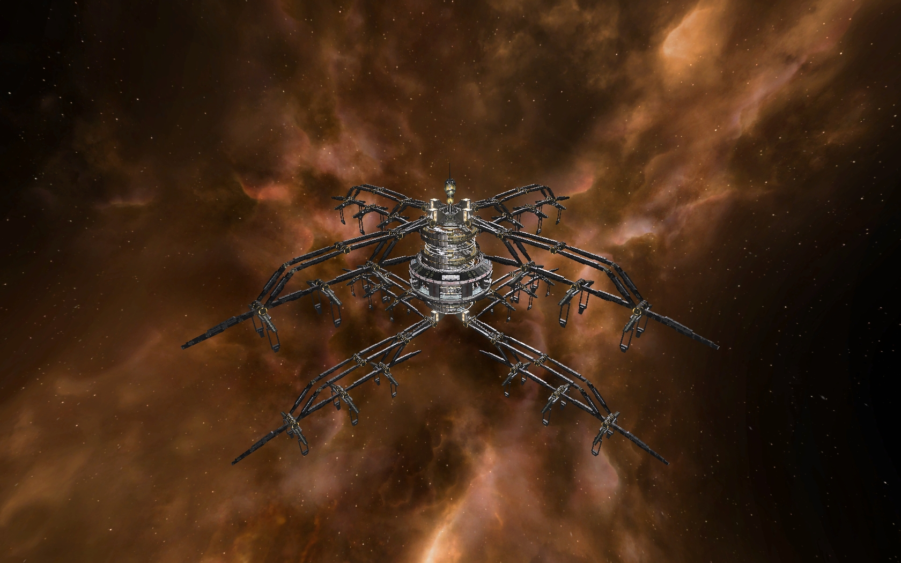

# Super Player Headquarter V1.0

This mod has the following features:
- Replace vanilla Player Headquarter model with a huge one (in terms of volume).
- 32 capital ships docks and internal docking for everything else.
- No "modified" tag.

Install:
- Install as false patch, i.e. copy "rename.cat" and "rename.dat" to X3FL game directory (X3 Terran Conflict\addon2\), then rename it to the next highest availiable number, "06.cat" and "06.dat" in case of X3FL 1.3.
- Be aware the model is huge, take necessary action before the patch to avoid possible collisions with other stations.
- If the PHQ is already in game, docked M6/TP will be using capital dock after patch, and the capital dock will be 11 instead of 32. Redock M6/TP should solve the first problem. Use a TL with building command software MK2 to pack and rebuild the PHQ should solve the second problem.

This mod is created by mkmark based on "Super Player Headquarter V1.0 for X3TC and X3AP" by Zeron-MK7, which is included in the "x3tc x3ap" folder. Nothing changed in the "x3fl" version except the model path is modified for the mod to be compatible in X3FL.
You can find Zeron-MK7's original work below with further notes.
- https://forum.egosoft.com/viewtopic.php?t=336412
- http://thexgalaxy.ucoz.com/load/x3_albion_prelude/super_player_headquarter/4-1-0-43
